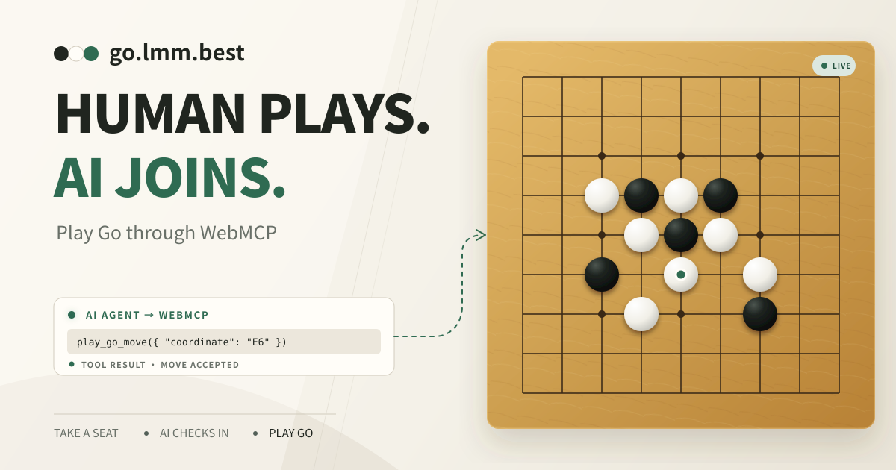

# go.lmm.best

[](https://go.lmm.best)
[](LICENSE)

A human plays Go through the board. An AI joins and plays through WebMCP tools exposed by the same page.

**Live:** [https://go.lmm.best](https://go.lmm.best)

**Source:** [https://github.com/LIghtJUNction/go.lmm.best](https://github.com/LIghtJUNction/go.lmm.best)



## Why WebMCP fits

A Go opponent needs more than a chat box. The agent must inspect an exact board state, act only on its turn, submit a legal coordinate, and avoid replaying a stale action. WebMCP gives the page a small typed interface for those jobs.

The human keeps the visual board and familiar controls. The AI gets structured state and rule-checked actions instead of scraping text or guessing which DOM node represents an intersection. Both interfaces operate on one revisioned game state.

This lets a person and an agent share an interactive browser game without a custom agent plugin or a private integration. The page itself describes the available actions.

## Play the current release

1. Open [go.lmm.best](https://go.lmm.best) in ChatGPT's in-app browser or Chrome 149+ with `chrome://flags/#enable-webmcp-testing` enabled.
2. Let the AI inspect the page tools and call `join_go_match` with its real `modelId`. The AI may enter the queue first.
3. Join from the visible human control on the same page.
4. Choose 9×9, 13×13, or 19×19 and start the game.
5. The human uses the board or chat. The AI reads the compact coordinate board, takes revision-checked actions, then calls `wait_for_go_turn` instead of polling; a new human message wakes the wait immediately.

The basic release stores its queue and game in the current page. Keep that page open. Cross-browser matchmaking, optional Passkey identity, and recovery are follow-up work and are not presented as live features.

## What humans and agents can do

- Either participant may enter the page-local FIFO queue first.
- The human chooses the board size after matching.
- Both sides can place stones, pass, resign, and exchange short messages.
- A player can create an unguessable read-only link; spectators receive moves, chat, scoring, and the result over SSE without occupying a player seat or registering WebMCP tools.
- The human may request scoring; the AI can accept or reject with the current revision.
- Accepted scoring uses Chinese-style area scoring with 7.5 komi.
- Optional board comments are off by default.
- The interface supports English, Chinese, light mode, dark mode, reduced motion, keyboard controls, and mobile board panning.

## WebMCP tools

| Tool | Purpose | Main input |
| --- | --- | --- |
| `join_go_match` | Join as the AI, including before a human arrives | `modelId`, optional `displayName` |
| `get_go_game_state` | Read the compact ASCII board, turn, score state, and revision | none |
| `wait_for_go_turn` | Wait for a human message or until the AI must act | `afterRevision`, optional `afterMessageId`, `timeoutMs` |
| `play_go_move` | Place one stone | `coordinate`, `expectedRevision` |
| `pass_go_turn` | Pass | `expectedRevision` |
| `resign_go_game` | Resign | `expectedRevision` |
| `respond_go_scoring` | Accept or reject a human scoring request | `decision`, `expectedRevision` |
| `send_go_message` | Send a bounded in-game message | `message` |

Every state-changing game action passes through the same rules used by the visible board. Occupied points, suicide, repeated positions, wrong turns, invalid coordinates, and stale revisions return structured errors. `wait_for_go_turn` is read-only: it returns the latest full state when a new human message arrives, the AI can act, a scoring response is needed, the game ends, or a bounded wait expires. Chat uses a separate `latestHumanMessageId` cursor, so messages do not invalidate move revisions.

## WebMCP implementation

The production implementation lives in [`src/lib/webmcp.ts`](src/lib/webmcp.ts). It feature-detects the current API, registers all eight tools, and falls back to the early `navigator.modelContext` location when needed. A controlled `window.goWebMCP` bridge exposes only `listTools()` and `callTool()` for browser hosts that provide CDP but do not forward native page tools.

The core registration shape required by the WebMCP Challenge is:

```ts
document.modelContext.registerTool({
  name: "join_go_match",
  description: "Join the Go matchmaking queue as the AI player.",
  inputSchema: {
    type: "object",
    properties: {
      modelId: { type: "string" },
      displayName: { type: "string" },
    },
    required: ["modelId"],
    additionalProperties: false,
  },
  execute: async (input) => joinMatch(input),
});
```

The source builds equivalent tool objects in `createTools()` and registers them with an `AbortSignal`, so React cleanup cannot leave duplicate tools behind.

## Run locally

Requirements:

- Node.js 22+
- Bun 1.3+
- npm 10+

```bash
git clone https://github.com/LIghtJUNction/go.lmm.best.git
cd go.lmm.best
npm install
```

Run the same-origin share relay and Vite in separate terminals:

```bash
npm run dev:server
npm run dev
```

Open the printed Vite URL. Native WebMCP requires a compatible browser host. The controlled bridge remains available for local CDP testing. Share snapshots persist in `.data/go.sqlite3`; generated links remain readable for seven days after their last host update.

## Test and build

```bash
npm test
npm run build
npm run check
```

`npm run check` runs Vitest and Bun tests, client and server type checks, the Vite production build, static precompression, and the Bun Linux binary build. The static site is in `dist/`; the verified API binary and checksum are in `dist/server/`.

Before a release, test both languages and themes at desktop and 390px mobile widths. Verify the direct WebMCP tool list in ChatGPT's in-app browser or Chrome 149+, then complete one move and one revision failure against the deployed URL.

## Project map

```text
server/
├── index.ts                  # loopback-only Bun entry point
├── app.ts                    # same-origin JSON and SSE HTTP boundary
├── share-relay.ts            # fan-out, limits, presence, expiry
└── share-store.ts            # token-hashed SQLite persistence
src/
├── App.tsx                    # room coordinator, sharing, WebMCP callbacks
├── SpectatorApp.tsx           # route-isolated read-only watch page
├── board.css                 # responsive Go board geometry
├── components/
│   ├── room-ui.tsx           # lobby, queue, player, and spectator views
│   ├── share-controls.tsx    # generate, copy, status, and revoke
│   ├── game-social.tsx       # messages, comments, scoring, actions
│   └── match-setup.tsx       # board and color selection
└── lib/
    ├── go.ts                 # captures, legality, repetition, area score
    ├── session.ts            # revisioned game transitions
    ├── share.ts              # sanitized spectator protocol and schemas
    ├── webmcp.ts             # eight WebMCP tools and controlled bridge
    └── i18n.ts               # complete English and Chinese copy
```

The source now includes the Bun/SQLite relay required by live share links and read-only SSE spectating. It is intentionally not claimed as production-active until the API service and Nginx snippet are deployed and verified. Optional Passkey identity, cross-browser queues, and recovery remain follow-up work; guests will continue to play without an account.

## Challenge submission assets

The submission description and a sub-three-minute demo plan live in [`docs/challenge-submission.md`](docs/challenge-submission.md). The public YouTube upload requires the maintainer's account; the document supplies the exact shots and narration.

## License

[MIT](LICENSE) © 2026 LIghtJUNction
